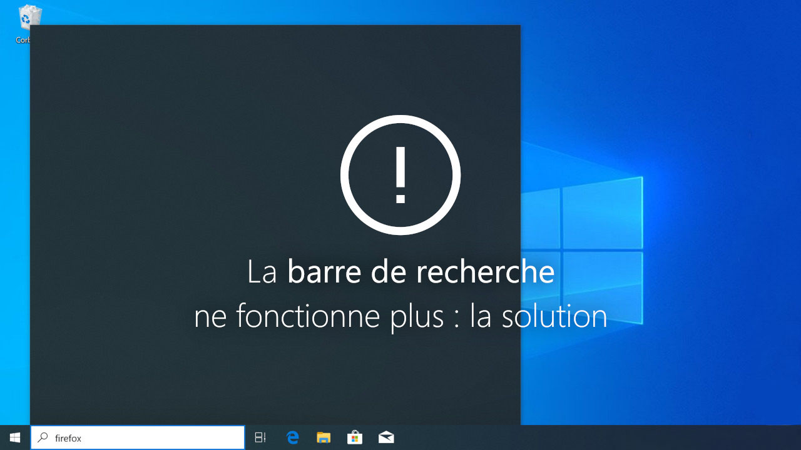

# Windows 10 keyboard problem solved

Vous aussi vous avez des problèmes avec le clavier qui ne s'active pas dans les recherches au démarrage, voici un programme qui lance au démarrage l'initialisation du clavier pour les barres de recherches

## Installation

1. Vous devrez vous rendre dans le dossier Startup, voici le chemin d'accès.  
⚠️ Pensez à changer "Votre Nom User" par votre nom d'utilisateur ⚠️

  `C:\Users\"Votre Nom User"\AppData\Roaming\Microsoft\Windows\Start Menu\Programs\Startup`

2. Faites glisser le fichier "clavier.bat" dans le dossier 📂

3. Ouvrez le gestionnaire des tâches, cliquez sur "Plus de détails" aller dans le menu démarrage et vérifier que le fichier "clavier" est activé. ✅

4. Vous pouvez redémarrer l'ordinateur et le tour et jouer 🔄

## Authors

- [@stanthblt](https://github.com/stanthblt)

## Support

For support, email contact@stan-thblt.com.
